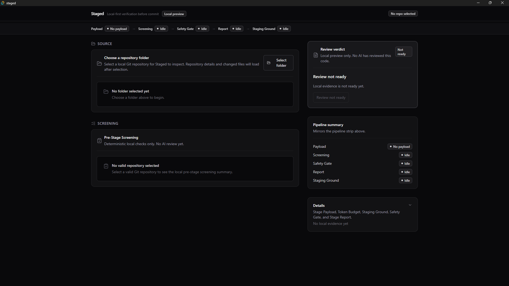
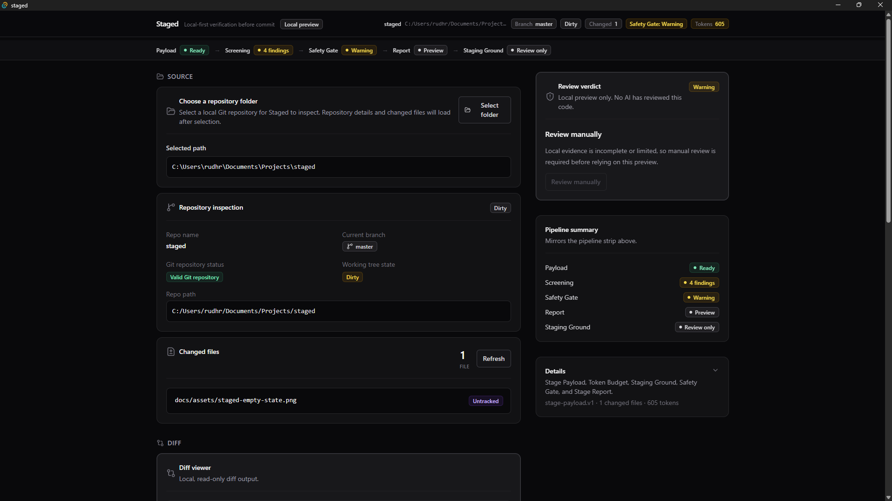

# Staged

Local-first verification before commit.

## Stack

- Tauri v2
- React
- TypeScript
- Vite
- Tailwind CSS

## Current milestone

Milestone 13: Provider/API Setup and Approval Flow is complete. The MVP cut ends here, before any real AI or LLM call.

Milestones 1, 2, 3, 4, 5, 6, 7, 8, 9, 10A, 11, 12 (including the 12F follow-up), and 13 are implemented. Staged can select a local Git repository, validate repository state, show repo metadata, list changed files, display read-only unified diffs for selected changed files, run allowlisted verification commands, show deterministic pre-stage screening findings without AI, build a read-only local Stage Payload preview from existing app state, show a local approximate Token Budget estimate for the current Stage Payload, present a local read-only Staging Ground before any future AI submission, run a local MVP Safety Gate with redacted preview, show a local read-only Stage Report preview generated from deterministic local evidence, copy that current local Stage Report as Markdown, and show local provider readiness metadata for a future AI approval flow.

The MVP proves the local-first verification and approval boundary: Staged reduces and audits the repository evidence that would be sent to an AI reviewer, making privacy, payload size, safety, and local evidence visible before any model call.

Final MVP acceptance criteria are tracked in [`docs/mvp-release-checklist.md`](docs/mvp-release-checklist.md).

Milestone 12 and its 12F follow-up (`docs/ui-visual-redesign-plan.md`) are implemented visual-only polish and redesign passes: a visible evidence pipeline strip, a rebalanced two-column layout, a review rail verdict card with collapsed payload/token details, grouped evidence workbench panels, unified status badges, and more readable code/diff/output blocks. No product behavior, backend behavior, AI/API integration, RAG implementation, Stage History, or persistence was added; the app is now more portfolio-demo and screenshot ready.

Milestone 13 is implemented as a local provider readiness and future approval gate. The backend checks whether `STAGED_OPENAI_API_KEY` is present, with `OPENAI_API_KEY` as a fallback when available, and returns only readiness metadata: configured state, provider name, environment variable source, and a user-facing message. API key values are never returned, displayed, logged, or persisted. Provider readiness is local environment detection only; it does not validate keys over the network.

The future `Generate AI Stage Report` action remains disabled because real structured AI Stage Report generation is post-MVP and not implemented yet. Disabled reasons are visible, Safety Gate `blocked` status prevents future submission eligibility, and the UI communicates that only a redacted payload may be submitted in a later milestone. No AI call, OpenAI integration, API request, network request, provider SDK, prompt construction, structured model output, Stage History, persistence, or RAG implementation exists yet.

## Demo Screenshots

Staged starts as a local-first pre-commit verification workbench before any AI/API integration.



The main workbench shows the current local repository workflow, evidence panels, and deterministic report preview.



## Current implementation status

Implemented:

- Tauri app shell.
- Tailwind-based Staged home screen.
- Tauri dialog plugin.
- Frontend folder picker.
- Selected folder path display.
- Rust Tauri command `inspect_repo`.
- Git repository validation.
- Repo name display.
- Repo path display.
- Current branch display.
- Clean/dirty working tree detection.
- Invalid folder error handling.
- Rust Tauri command `list_changed_files`.
- Git status retrieval with `git status --porcelain=v1 --untracked-files=all`.
- Changed-file parsing for added, modified, deleted, renamed, copied, and untracked files.
- Index and worktree status preservation.
- Frontend changed-files panel.
- Changed-file count.
- Clean repo empty state.
- Git status error state.
- Manual `Refresh changed files` button.
- Correct changed-file path parsing, including `README.md` and untracked files.
- Rust Tauri command `get_file_diff`.
- Rust Tauri command `get_repo_diff`.
- Git diff retrieval with `git diff --no-ext-diff`.
- File-specific diff retrieval with `git diff --no-ext-diff -- <file_path>`.
- Basic staged fallback with `git diff --cached --no-ext-diff -- <file_path>`.
- Frontend helper `getFileDiff`.
- Clickable changed-file rows.
- Selected file state.
- Read-only diff viewer panel.
- Unified diff text rendered in a whitespace-preserving monospace block.
- Empty diff viewer state when no file is selected.
- Loading state while fetching a diff.
- Error state when diff retrieval fails.
- No-diff state for untracked files or files with no available Git diff.
- Selected diff clears on repo switch and refresh.
- Rust Tauri command `run_repo_command`.
- Strict command ID allowlist: `npm_test`, `npm_lint`, and `npm_typecheck`.
- No arbitrary shell command input.
- Commands run inside the selected Git repository.
- Windows-compatible npm executable handling.
- Captured stdout, stderr, exit code, and duration in milliseconds.
- Success/failure command result based on exit code.
- Non-zero exit codes return valid command results instead of app errors.
- Frontend command runner panel.
- Read-only stdout/stderr output blocks.
- Command loading, success, failure, and error states.
- Rust Tauri command `get_available_repo_commands`.
- Repo-aware command availability detection from the root `package.json`.
- Disabled unavailable command buttons with reasons.
- Empty state when no supported npm scripts are found.
- Command runner state clears when switching repos or selecting invalid folders.
- Frontend Pre-Stage Screening panel.
- Deterministic local findings built from existing app state.
- Repo summary in the screening panel.
- Changed-file count summary.
- File status counts for added, modified, deleted, renamed, copied, untracked, and unknown files.
- Command runner summary in the screening panel.
- Screening findings with `pass`, `info`, `warning`, and `fail` levels.
- Findings for valid repo selection, no changed files, untracked files, deleted files, renamed/copied files, command checks not run, latest command success, latest command failure, command execution error, and no supported npm scripts.
- Read-only screening UI.
- Clear separation between deterministic screening and future AI review.
- Screening panel clears stale state when selecting invalid folders or switching repos.
- Frontend `StagePayload` type.
- Frontend `buildStagePayload` utility.
- Read-only Stage Payload preview panel.
- Formatted JSON payload preview using `JSON.stringify(payload, null, 2)`.
- Stage Payload built from existing local app state only.
- Repo metadata in the Stage Payload.
- Changed-file summary in the Stage Payload.
- Changed-file status counts in the Stage Payload.
- Changed files list in the Stage Payload.
- Selected-file metadata in the Stage Payload.
- Selected-file diff included only when already loaded.
- Latest command result included when available.
- Command error included when available.
- Command availability snapshot included.
- Pre-Stage Screening findings included.
- Payload completeness metadata included to make missing evidence visible.
- Payload limitations list included.
- Clear local-preview warning that the Stage Payload is local, no AI call has been made, and redaction preview is handled separately by Safety Gate.
- Frontend `TokenBudget` type.
- Frontend `buildTokenBudget` utility.
- Read-only Token Budget panel.
- Local Token Budget estimate computed from the current Stage Payload.
- Estimated payload character count.
- Estimated payload byte count.
- Estimated token count using `Math.ceil(character_count / 4)`.
- Estimator name `chars_div_4`.
- Estimator note explaining the estimate is approximate and tokenizer-independent.
- Section-level payload size breakdown.
- Section percentages.
- Sections sorted by size.
- Token Budget warnings for approximate estimation, missing selected-file diff content, changed files listed without diff content, untracked file contents not included, missing command results, missing supported npm scripts, secret redaction not implemented, large payload size, large selected-file diff, and large command output.
- Frontend `StagingGroundReadiness` type.
- Frontend `buildStagingGroundReadiness` utility.
- Read-only Staging Ground panel.
- Local pre-submission review surface based on the current Stage Payload and Token Budget.
- Readiness summary for the current Stage Payload.
- Readiness checklist for Stage Payload, selected-file diff, command result, Token Budget, secret redaction, and AI review availability.
- Missing-evidence and current-limitation messages.
- Clear local-preview wording.
- Clear no-AI-call wording.
- Disabled/non-functional AI review action area.
- Explicit blocked state because AI review is not implemented.
- Safety Gate status integrated into Staging Ground readiness.
- Frontend `SafetyGateResult` type.
- Frontend `buildSafetyGateResult` utility.
- Frontend Safety Gate panel.
- Local pattern scanner over the serialized Stage Payload JSON.
- Direct scanner over the currently loaded selected-file diff.
- Detection for likely secret assignments such as `API_KEY=...`, `TOKEN=...`, `PASSWORD=...`, `SECRET=...`, `PRIVATE_KEY=...`, and `ACCESS_KEY=...`.
- Detection for private key markers.
- Detection for local machine path exposure.
- Safety Gate statuses: `pass`, `warning`, and `blocked`.
- Redacted payload preview.
- Original Stage Payload remains unchanged by redaction preview.
- Scan coverage summary.
- Scanner limitations shown in the UI.
- Clear local-only wording: no API call is made and no data is sent anywhere.
- Staging Ground state clears when no valid repo or payload exists.
- Frontend `StageReport` type.
- Frontend `buildLocalStageReportPreview` utility.
- Frontend Stage Report panel.
- Local read-only Stage Report preview.
- Report generated from existing local frontend state only.
- Report metadata.
- Repo and change summary.
- Deterministic evidence summary.
- Pre-Stage Screening findings included.
- Command result summary included when available.
- Safety Gate status included.
- Token Budget estimate included.
- Payload limitations included.
- Deterministic local-preview risk findings.
- Missing evidence list.
- Human review checklist.
- Conservative recommendation logic.
- Safety Gate blocked status leads to `do_not_submit`.
- Clear local-preview wording.
- Clear no-AI-review wording.
- Frontend `formatStageReportMarkdown(report)` utility.
- Markdown export generated from the current local `StageReport`.
- Copy Markdown control in the Stage Report panel.
- Clipboard copy using browser clipboard APIs.
- Simple copied/error state.
- Read-only Markdown preview.
- Exported Markdown includes local-preview and no-AI warning, report metadata, repository/change summary, deterministic evidence, Safety Gate status, Token Budget estimate, command result summary when available, screening findings, payload limitations, risk findings, missing evidence, human review checklist, and recommendation.
- Markdown Export is local-only, not AI-generated, not persisted, and not cloud-synced.
- Backend provider readiness command for future AI setup.
- Local detection of `STAGED_OPENAI_API_KEY`.
- Local fallback detection of `OPENAI_API_KEY` when available.
- Provider readiness metadata with configured boolean, provider name, environment variable source, and message.
- API key values are not returned, displayed, logged, or persisted.
- Provider readiness is not validated over the network.
- Frontend Provider Readiness / Future AI Approval UI.
- Visible disabled reasons for the future AI action.
- Future `Generate AI Stage Report` action remains disabled.
- Safety Gate `blocked` status prevents future submission eligibility.
- Redacted-payload-only rule is communicated for the future submission path.
- No API calls.
- No LLM calls.
- No provider or model selection.
- No provider SDK.
- No prompt construction.
- No backend AI generation logic.
- No persistence.
- No Stage History.

Not implemented yet:

- Workspace or nested package command detection.
- Risk classifier.
- Backend scanning.
- Full-repo scanning.
- Submit behavior.
- Safety Gate enforcement for an actual network submission path.
- SQLite.
- Stage History.
- Real structured AI Stage Report generation.
- Real OpenAI/API request integration.
- Provider or model selection.
- Prompt construction.
- Structured output validation from model responses.
- Retry or streaming behavior.
- AI features.
- RAG.
- Tree-sitter.
- Vector search.
- GitHub PR integration.
- GitHub PR comment export.
- PDF export.
- DOCX export.
- Auto-fixing.

## Development

Start the Vite development server:

```bash
npm run dev
```

Start the Tauri desktop app:

```bash
npm run tauri dev
```

Build the frontend:

```bash
npm run build
```
